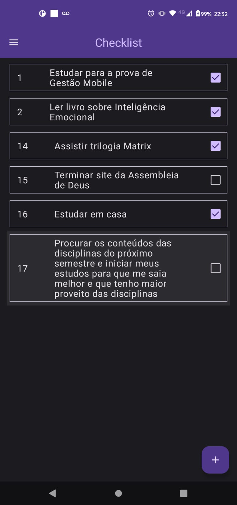
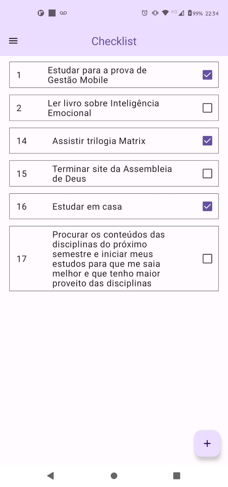
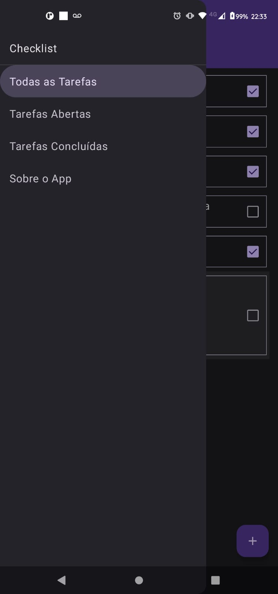
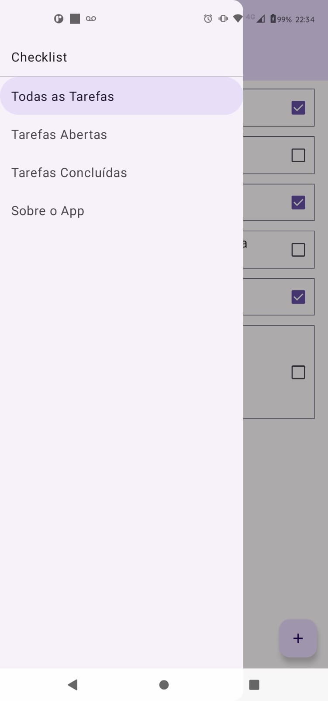
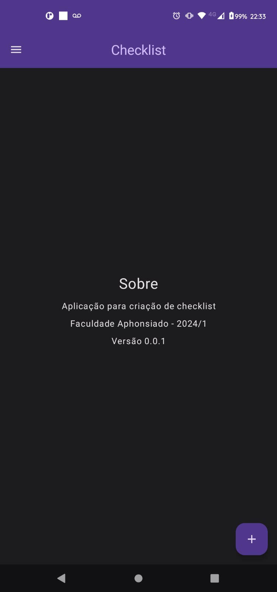
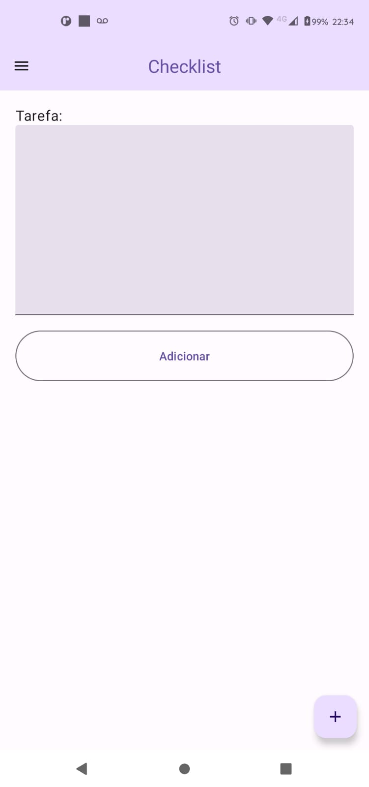
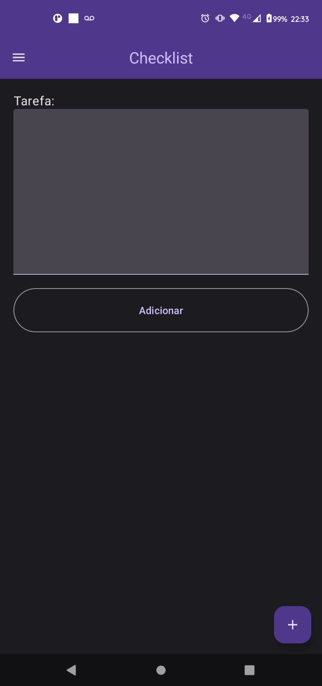

# Checklist

Para controle de suas atividades diárias, este app veio para ajudar você a não se esquecer de nada!

#### Screenshots

## Avaliação

### Setup

1. Clone o repositório informado pelo professor
    * https://github.com/ramyres110/mobile-happy-birthday 
2. Abra o projeto no Android Studio
    * Identificar local do clone
    * Abrir e verificar as mensagens de alerta
3. Compile o App
    * Verificar se foi compilado com sucesso (BUILD SUCCESS)
4. Execute o App
    * Abrir o app em uma VM ou no dispositivo

### Atividades

#### Orientações
* **Avaliação individual, não sendo permitido contato com colega, caso ocorra a prova será desconsiderada e a nota será zerada!**
* **Avaliação prática, logo:**
    * Permite a utilização de computador
    * Permite a utilização de programas
    * Permite acesso a internet
* **Realize commits por atividade. Ex:**
1. Finalizou a atividade 1
2. Adicione os arquivos alterados no git
3. Realize o git commit do que foi feito com a mensagem: `Atividade 1 concluída`
* **As questões não são dependentes uma da outra, lembre-se do tempo de prova (19h às 21h)**

#### Questões

1. (2,0) [Componente] Altere o nome dos componentes Lista, Sobre e Cadastro para TelaLista, TelaSobre e TelaCadastro.
5. (2,0) [Modificadores] Na tela de Cadastro altere a altura do TextField para 350.dp e corrija o botão de adicionar (texto e tamanho utilizando o fillMaxWidth)
4. (2,0) [Estado] Altere o estado tela para em vez de ser um número inteiro seja uma string e mude as ocorrências por:
    * 0 --> LISTA
    * 1 --> SOBRE
    * 2 --> CADASTRO
2. (2,0) [Componente] Altere o texto do cabeçalho para "Lista de Tarefas", verifique se modificou também no menu lateral!
3. (2,0) [Evento] Na Lista corrija o evento onCheckedChange para que marque a tarefa com concluída ao clicar no Checkbox.

### Entrega

1. Realize o commit por tarefa com a mensagem: `Atividade X concluída`
2. Ao final, feche o Android Studio e na pasta do repositório:
    - Apague a pasta `\app\build` (pois nela tem os compilados)
    - Apague a pasta  `\gradle` (pois há um .jar)
3. Compacte a "pasta do repositório" e envie o Google Drive
    - A pasta ".git" deve estar no arquivo comprimido!
4. Gere o link de compartilhamento e envie por email com as orientações:
    - **Título**: Prova de Gestao Mobile N2 2024-1
    - **Remetente**: [ramyres90@gmail](mailto:ramyres90@gmail.com?subject=Prova%20%de%20%Gestao%20%Mobile%20%N2%20%2024-1&body=Segue%20%link%20%da%20%pasta%20%compactado%20%da%20%avaliacao%20%pratica%20%de%20%Gestao%20%Mobile)
    - **Conteúdo**: Segue o link da pasta compactada da avaliação prática de Gestão Mobile.

\
\
\
------------ BOA SORTE, ATENÇÃO E COMPENTÊNCIA ------------